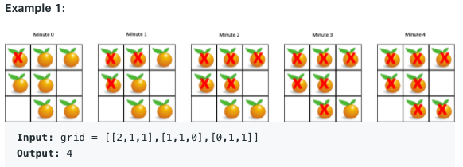

# Graph search


## Graph summary 

1. case like number of island 

   step1: go through matrix, find island '1'

   step2: use dfs to go through four directions to search all '1' and flip it to '0'

   Step3: count how many '1' left over. 

2. case like word search

   step1: go through matrix, find the point where word.charAt(index) in matrix

   step2: use dfs to go through four directions to search next word's character exist, which we use boolean visited matrix to track path and prevent search back previous spots. 

   Step3: return true if find or false

3. case like  Number of Connected Components in an Undirected Graph

   https://leetcode.com/problems/number-of-connected-components-in-an-undirected-graph/

   Step1: we build graph first e.g Map<Integer, List<Integer>> map

   Step2: we fill graph in term of undirected graph pr directed graph condition

   For(int[] edge: edges) {

   ​	map.get(edge[0]).add(edge[1]);

   ​	map.get(edge[1]).add(edge[0]); //undirected graph

   }

   step3: go through graph from initial state, and dfs from this node, given hashset visited to prevent revisit same node, operate answer in term of reuirement

   step 4: return results

4. case like bipartion or can finish prerequisites courses

   this difference here is we have to be careful about if visited point to be a cycle

   for example, in prereleases courses, we set int[] visited 0 is unvisited, -1 visiting,1 is visited

   when we traverse dfs. we set up visited[i] = -1, we visiting now.

   when we traverse dfs, visited[i] = -1 mean current cycle, if traverse this point, which mean it cycle. 

   when we traverse dfs, visited[i] = 1, mean it previous visited, it's fine. 

   **However**, in the problem, bipart, we only need to separate current node and its nei, either node = 1, neighbored = -1. 

   

5. case like find minimum height trees

   https://leetcode.com/problems/minimum-height-trees/


## BFS and DFS difference explain 

## BFS

case 1. rotting orange 



```java
Queue<int[]> q = new LinkedList<>();
for (int r = 0; r < grid.length; r++) {
    for (int c = 0; c < grid[0].length; c++) {
        if (grid[r][c] == 2) {
            q.offer(new int[]{r,c}); // store all initially starting to rotten point
        }
    }
}
//rotting started
int minutes = -1;
while (!q.isEmpty()) {
    int size = q.size();
    for (int s =0; s < size; s++) {
        int[] state = q.poll();
        int r0 = state[0];
        int c0 = state[1];

        for (int[] dir: dirs) {
            int r = r0 + dir[0];
            int c = c0 + dir[1];
            // check if it can move to neighbors
            if (r >= 0 && r < grid.length && c >= 0 && c < grid[0].length && grid[r][c] == 1) {
                q.offer(new int[]{r, c});
                grid[r][c] = 2; //rotten
            }
        }
    }
    minutes++; // 在run size of q的loop才能保证所有的rotten point 同时 expand 周围， 然后才能加时间
}
//check if all fresh orange rotten
for (int r = 0; r < grid.length; r++) {
    for (int c = 0; c < grid[0].length; c++) {
        if (grid[r][c] == 1) {
           return -1;
        }
    }
}
if (minutes == -1 ) return 0;
return minutes;
```

**Solution**:

1. We find initial state, in this problem it's grid element equals to 2. It could be mutiply points. 

2. We use Queue to store and track those point, and expand it to four directions. 
3. Given the condition, we add new expanded point to Queue for next round. 
4. Update the result we need, in this problem, we need update time. But we have to be careful the result is based on every round of loop of queue, not single queue state. It depends on problem by problem. 

## DFS

int[] nums = new int[] {1,2,3}

case 1: subset

```java
private void dfsSubset(int[] nums, int index, List<Integer> curr, List<List<Integer>> res) {
    if (index > nums.length) {
        return;
    }
    res.add(new ArrayList<>(curr));
    for (int i = index; i <nums.length; i++) {
        curr.add(nums[i]);
        dfsSubset(nums, i + 1, curr, res); // i+1 is key, to narrow down next element of nums[i]
        curr.remove(curr.size() - 1);
    }
}
```


As pic above seen, for (int i = index; i <nums.length; i++) is actually gradually reduce branches, dfsSubset(nums, i + 1, curr, res); is keep tree move to next state. At each node, it been added to res list. 


case 2: permutations 

```java
for (int i = 0; i < nums.length; i++) {
    //System.out.println("current index: " + i);
    if (!cur.contains(nums[i])) { //这个条件其实是砍掉了树枝
        //System.out.println("add value: " + nums[i]);
        cur.add(nums[i]);
        dfsPermute(nums, res, cur);
        //System.out.println("remove value " + cur.get(cur.size() -1));
        cur.remove(cur.size() - 1);
    }
}
```

Tree map look like 

​						

